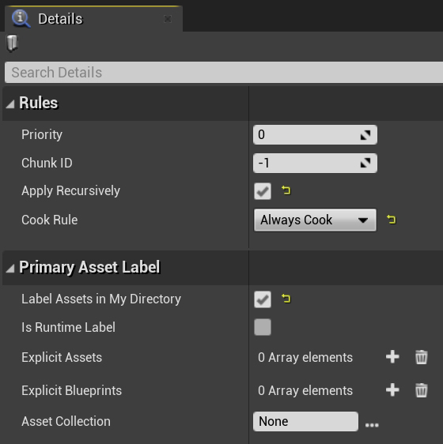
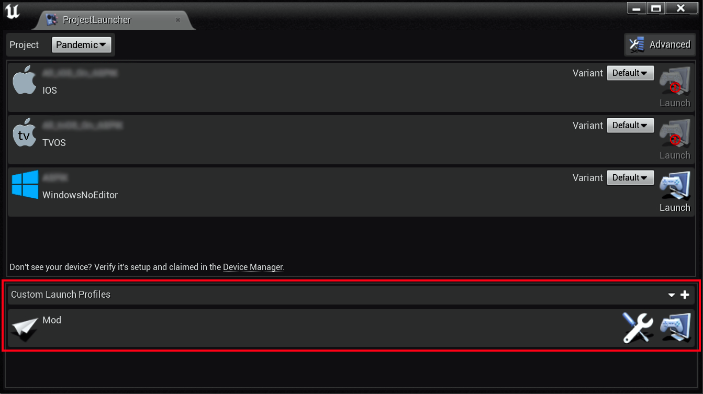

# Creating Mod Packages (Plugins)

:::info
This section covers creating packages recognized by the game natively (plugin mod packages), replacing or adding new content to the game.
:::

### Prerequisites

* **[Unreal Engine 4.27](https://www.unrealengine.com/en-US/download)**
* **[Mod Tools](https://github.com/AffrayCo/SCP5K-Mod-Tools)** and [MkRelease](assets/MkRelease.bat) - tools created by AffrayCo, **Mod Tools not required if not utilizing the [SDK](../../sdk/sdksetup/index.md)**
* **[Project Launcher Profile](assets/MOD_F284BEC24BF267052C7A26807BF9AF1E.ulp2)**

### Creating the Mod Plugin

To create a plugin for modding in Unreal Engine 4.27:

1. Open Unreal Engine 4.27, then go to `Edit > Plugins`.
2. Click `New Plugin` to open the _Plugin Creator_.
3. Select `Content Only`.
4. Enter a `Plugin Name`, and fill out the `Author` and (optionally) `Description` fields.
5. Once the plugin has been created, place all your mod content inside the plugin’s folder.
6. In the `Content Browser`, right-click and select `Miscellaneous > Data Asset`, then search for `PrimaryAssetLabel`.

Fill out the `Data Asset` as shown below:

### Creating a MkRelease Script

1. Download the [MkRelease](assets/MkRelease.bat) batch script.
2. Open `PowerShell` by right-click inside the `File Explorer` and selecting `Open in Terminal`.
3. Run the following command:

`& "C:\Your Project Name\MkRelease.bat" "C:\Program Files\Epic Games\UE_4.27" "Your Game Install Directory\5K" "Current Game Version"`

- **Your Project Name** — The name of your Unreal Engine project (where your .uproject file is located).
- **Your Game Install Directory** — The installation directory of the game (where Pandemic.exe is located).
- **Current Game Version** — The version of the game your mod targets, e.g. 0.17.1.

If successful, a few new folders and files should be created in your project folder:

`Releases > 0.17.1 > WindowsNoEditor > AssetRegistry.bin & Metadata > DevelopmentAssetRegistry.bin`

### Packaging the Mod Plugin

After creating your plugin and placing your mod content, navigate to `Window > Project Launcher`
1. Install the **[Project Launcher Profile.](assets/MOD_F284BEC24BF267052C7A26807BF9AF1E.ulp2)** This file should be placed in your Engine install directory under `UE_4.27\Engine\Programs\UnrealFrontend\Profiles`
2. A new profile called `Mod` should now appear in the `Project Launcher`.

3. Click the Wrench icon to edit the profile, then under `Package`, set your desired `Output Folder`.
4. In the _Cook_ section, update the `Release version` fields under both `Advanced Settings` and `Release / DLC / Patching Settings`.
5. Change `Name of the DLC to build` to match your `Mod Plugin` name. **This is important!**
6. After packaging, your mod files will be located in the output folder, next [install your mod!](../modinstallation/index.md)

