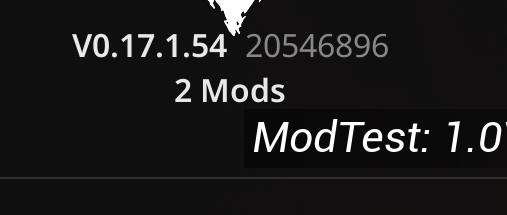

# Mod Installation (Mod Packages)

After the **Mod Support update - 0.17.1**, the game now allows mods to be loaded and recognized by the game natively, all files should be place in a specific directory in your game installation.

- First off, as of 0.17.1, Mod Support needs to be manually enabled via a launch command.

1. In your Steam Library, right-click the game and select Properties.
2. Under Launch Options, enter the following command: `-enablemods`

- To install the mod package:

1. Navigate to your game installation directory: (C:\SteamLibrary\steamapps\common\)`\5K\WindowsNoEditor\Pandemic\`
2. If it doesn’t already exist, create a new folder named `Mods`.
3. Place your `Mod Package` inside the `Mods` directory.
4. Launch the game. Now you should notice your installed mods show up in the menus! Hover over to see the list of currently loaded mods.

