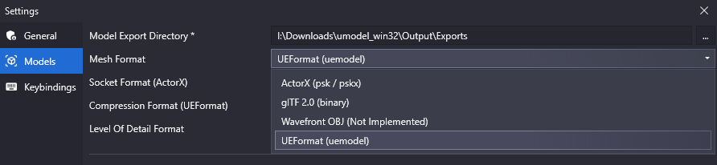
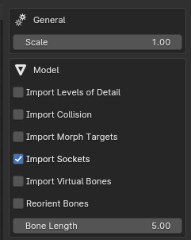
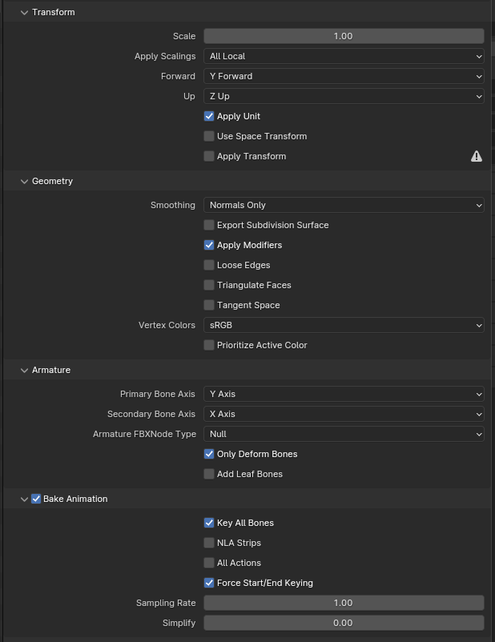

# Skeletal Meshes

### Prerequisites

* **[Unreal Engine 4.27](https://www.unrealengine.com/en-US/download)**
* **[Blender](https://store.steampowered.com/app/365670/Blender/)** or alternative.
* **[FModel](https://fmodel.app)** a tool for extracting files from game packages `(.pak)`.
* **[UEFormat](https://github.com/h4lfheart/UEFormat?tab=readme-ov-file)** allows importing FModel extracted assets (Blender only).

### Extracting Models from Game Packages

1. Open `FModel` and set the **Loading Mode** to **All Packages**. Locate the following asset: `Pandemic/Plugins/AffrayCore/FPSController/Content/Weapons/Glock19X/Meshes`.

:::tip
FModel has a search function that you can access by pressing `CTRL+SHIFT+F`, allowing you to quickly search for the asset you need.
:::

2. Right-click on the `SK_Glock19X .uasset` and select `Save Model`.

:::warning
FModel supports several formats. It is recommended to the `.UEModel` format, though you may also use the `.PSK` format.

:::

### Importing and Exporting the Model with Blender

1. Open Blender and [install the UEFormat addon](https://docs.blender.org/manual/en/latest/editors/preferences/addons.html)
2. Restart Blender, then navigate to `File > Import > Unreal Model (.uemodel)`
3. Select the model you want to import and adjust the import settings as shown below:

4. After making the desired changes to the imported model, rename the armature object to **Armature**. Then, in the Scene tab, set the **Unit Scale to 0.01**.
5. When exporting the model, use the `.FBX` format and apply the following settings:

### Importing the Model into Unreal Editor

1. Create a folder hierarchy that matches the location of the extracted asset, in our case: `Plugins/AffrayCore/FPSController/Content/Weapons/Glock19X/Meshes/`

:::danger
To include your content in a Plugin directory, open Unreal Engine and navigate to `Edit > Plugins` and open the **Plugins** window.
From there, click **New Plugin**. Name the plugin **FPSController**, select **Content Only**, and then click **Create Plugin**.

If you can't see the newly created plugin, ensure that **Show Plugin Content** is enabled in the  **View Options**.
:::

2. **Drag & drop** or **Add/Import** your model in the **Content Browser**. When the **FBX Import Options** window appears, adjust the settings as shown below before clicking **Import All**.

### Creating Materials and Textures

:::info
This section is optional unless you want to create your own textures and materials.
:::

**Work in progress...**
