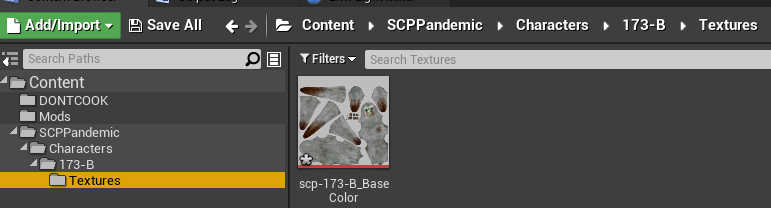

# Custom Textures

:::info
Replacing textures is the easiest way to start modding. I recommend starting here if you're new to modding Unreal Engine games.
:::

### Prerequisites

* **[Photoshop](https://www.adobe.com/products/photoshop.html), [GIMP](https://www.gimp.org), [paint.net](https://www.getpaint.net)** or alternative
* **[FModel](https://fmodel.app)** a tool for extracting files from game packages `(.pak)`.

### Extracting Textures from the Game Files

To start, we need to extract textures from the game packages.

1. Open either `FModel` or `UModel` (FModel is recommended for its ease of use and continuous support).
2. Locate the texture in the game files that you want to modify, for instance `SCPPandemic/Characters/173-B/Textures/scp-173-B_BaseColor`.
3. Right-click on the texture and select `Save Texture .png` to extract it.

4. Edit and export the texture using the image editing software of your choice. For Unreal Engine, it is recommended to use `.TGA` or `.PNG`.

### Reimporting Your Textures in Unreal Engine

1. Open your Unreal Engine mod project and create a folder structure that matches the location of the extracted texture. In the case of our SCP-173 example, it would be as follows:

`Content > SCPPandemic > Characters > 173-B > Textures`

2. Once all files have been reimported, you can **[package your mod](../creatingpackages/index.md).**

**Your texture should now be visible in-game!**

:::tip
Rather than creating the folders manually, you may simply **drag & drop the extracted folders**, this will automatically create the hierarchy for you.
:::

