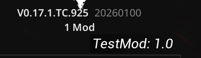

# Create a New Mod

:::warning
Creating a new mod (as a plugin) requires the SDK, Mod Tools plugin and enabling modding support via a launch command.

This feature and the SDK are still under development by Affray and me, expect issues and certain limitations!
:::

# Enable Modding

Add the following launch argument:

`-enablemods` enables mod support

Other useful arguments:

`-allowoldmods` allows mods that are listed as for an older version of the game
`-allowunversionedmods` allows mods that have no game version listed
`-enablerawpakmods` enables mounting pak based mods with asset registry support but no binaries, checksum or other advanced features

# Install the Mod Tools Plugin

To get correctly exported mod files, you need to install the Modding Tools plugin from the following link:

https://github.com/AffrayCo/SCP5K-Mod-Tools

Next, install and enable the plugin in the project settings.

1. After downloading the plugin, place the contents in: `SCP5K_SDK_Build\Plugins`
2. In your SDK project, head over to `Edit > Plugins` and enable the Modding plugin.
3. Restart the editor.

# Create a New Plugin

1. Just like before, go to the Plguins window and create a new Blank plugin.
2. Make sure to fill out the Author and Description fields!
3. Add your files in the new plugin folder. This will be the folder of your mod where you can add your content.

# Mod Packaging

Once you are done with your mod, it needs to be packaged with an asset registry so that the game can find it and load correctly.

Next, download the **SCP5K MOD PROFILE** and place it in `UE_4.27\Engine\Programs\UnrealFrontend\Profiles`

[SCP5K MOD PROFILE_F284BEC24BF267052C7A26807BF9AF1E.ulp2](assets/SCP5K%20MOD%20PROFILE_F284BEC24BF267052C7A26807BF9AF1E.ulp2)

1. Navigate to `Window > Project Launcher > Edit Profile`
2. Under `Package`, change the `Local Directory Path` to your desired output folder. This is where the mod will be packaged to.
3. Next, under `Cook`, make sure that the `Release version` is correctly set and set the `Name of the DLC` to match your mod's name.
4. Go back and `Launch this Profile`.
5. Your mod should now be packaged and can be found in the output folder, for example, `SCP5K_SDK_Build\Mods\WindowsNoEditor\Pandemic\Plugins`.

# Editing Mod Descriptor

Open the .uplugin file in the plugin folder and make sure to fill out any missing fields.

**Example mod descriptor:**

`{
"FileVersion": 3,
"Version": 1,
"VersionName": "1.0",
"FriendlyName": "CustomWeaponTest",
"Description": "Test mod",
"Category": "Mods",
"CreatedBy": "Unselles",
"CreatedByURL": "",
"DocsURL": "",
"MarketplaceURL": "",
"CanContainContent": true,
"IsBetaVersion": false,
"IsExperimentalVersion": false,
"Installed": false,
"SupportedVersions": [
"0.17.1"
],
"IncludeInChecksum": true,
"IncompatibleMods": [],
"SupportURL": "",
"ExplicitlyLoaded": true
}`

After editing the descriptor, place the mod folder in the `Mods` folder of your SCP:5K installation `5K\WindowsNoEditor\Pandemic\Mods` (create the folder if it doesn't exist).

Your mod should now be loaded and ready to use! 

