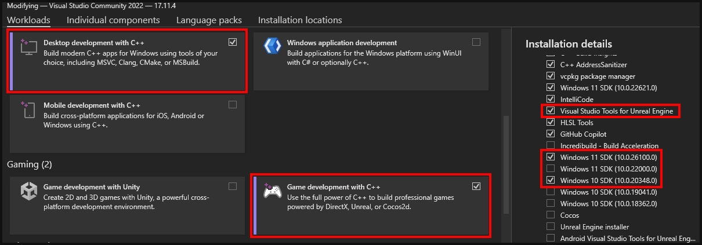
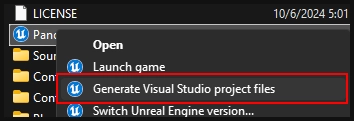
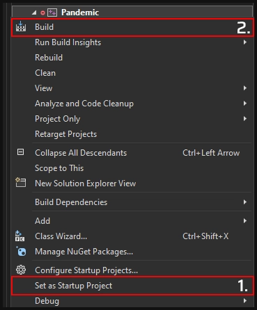

# Setting up the Unofficial SDK

:::warning
This is an advanced section and requires **Visual Studio** and compiling of the project. Read the instructions carefully.
:::

### Visual Studio requirements

Download and install:
* [Visual Studio 2022 Community](https://visualstudio.microsoft.com/thank-you-downloading-visual-studio/?sku=Community&channel=Release&version=VS2022&source=VSLandingPage&cid=2030&passive=false)
  
Follow the installation instructions, in the `Workloads` section, make sure to tick the following:

* [Unreal Engine](https://www.unrealengine.com/en-US/download)

It is recommended to use the Epic Games Launcher, follow the instructions and install `Unreal Engine 4.27.2` from the `Unreal Engine` section in the `Library` tab.

* [.NET 8.0 Desktop Runtime](https://dotnet.microsoft.com/en-us/download/dotnet/thank-you/runtime-desktop-8.0.8-windows-x64-installer)

### Generating project files

1. Download or clone the [SCP5K SDK](https://github.com/unselles/SCP5K_SDK), cloning is recommended for future updates.
2. After downloading/cloning, right-click the `.uproject` and `Generate Visual Studio project files`.

:::info
If the project generated successfully, a few **new folders/files will show up**. (e.g. the Intermediate folder and .sln file)
:::

### Compiling the project in Visual Studio

1. Make sure the solution configuration is set to `Development Editor Win64`.
2. Right-click the Pandemic solution `(Pandemic.sln)` and open with `Visual Studio` or `Rider`.
3. After Visual Studio opens, find the `Pandemic` project, right-click and `Set as Startup Project`.

3. Open the context menu again and `Build` the solution.

:::info
Building projects can take a while, ignore the warnings and watch for any errors.
:::

### Opening the project

1. Extract the zipped `UE4Editor-PlanarCut`.
2. Move the extracted file to `Binaries\Win64`.
3. Open `Pandemic.uproject`, the editor should startup and start compiling shaders.

:::warning
It's required to move the **UE4Editor-PlanarCut.dll** each time the project compiles, the editor will not start otherwise.
:::